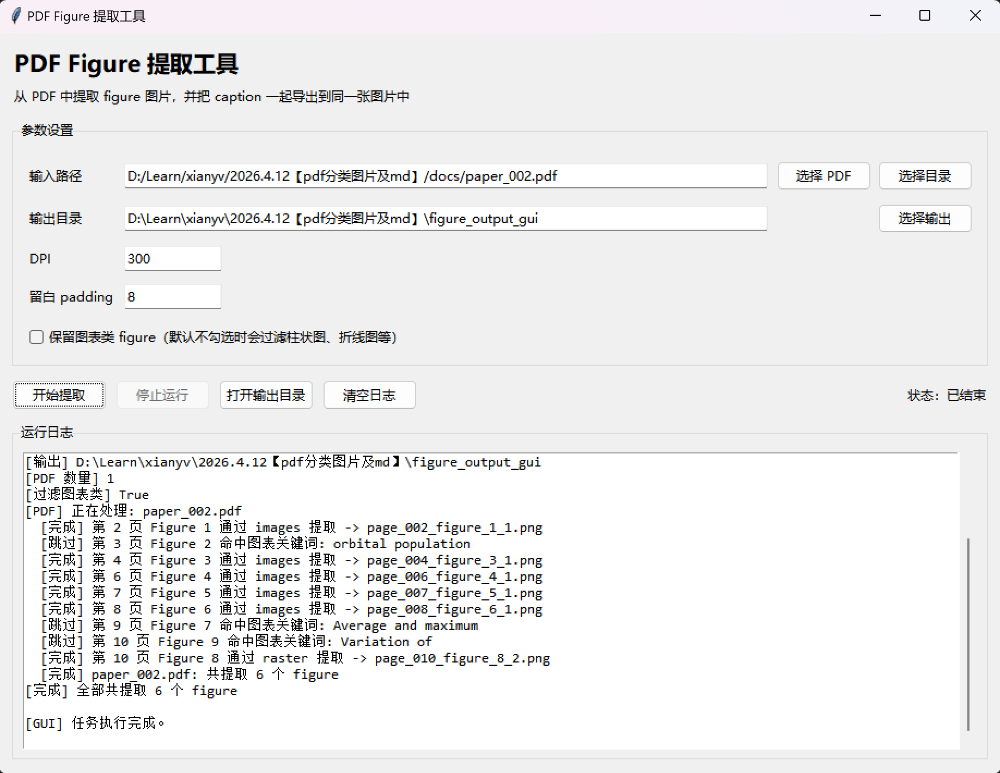

# PDF Figure Extractor

一个用于从学术论文 PDF 中提取完整 figure 图片的工具。它会自动定位 `Figure` / `Fig.` caption，识别对应图像区域，并将 figure 主体和 caption 合并导出，同时生成便于检查和二次处理的 `Markdown` 与 `JSON` 结果。

项目同时提供命令行版和 GUI 版，适合快速处理单篇论文，也适合批量处理一个目录下的多个 PDF。

## 项目效果

### GUI 首页



### 输出示例

以下示例来自 `docs/paper_002.pdf` 的实际提取结果，输出目录位于 `docs/examples/paper_002/`。

**示例 1：完整结构图 + caption**


**示例 2：多子图排版**


**示例 3：密度分布图**


## 功能特性

- 支持单个 PDF 文件处理
- 支持批量处理目录下的多个 PDF
- 自动识别 `Figure` / `Fig.` caption
- 自动裁剪并导出完整 figure
- 支持单栏、双栏、通栏页面
- 支持基于图像、矢量绘图、栅格区域的多种提取方式
- 默认过滤部分图表类 figure，也可手动保留
- 同时输出 `images/`、`figures.md`、`figures.json`
- 提供命令行和 GUI 两种使用方式

## 项目结构

```text
.
├─ extract_figures.py              # 命令行主脚本
├─ figure_extractor_gui.py         # GUI 入口
├─ docs/
│  ├─ paper_002.pdf                # 示例 PDF
│  ├─ paper_003.pdf                # 示例 PDF
│  ├─ screenshots/
│  │  └─ gui-home.png              # README 展示用 GUI 截图
│  └─ examples/
│     └─ paper_002/
│        ├─ figures.json           # 示例结构化输出
│        ├─ figures.md             # 示例 Markdown 输出
│        └─ images/                # 示例提取图片
├─ .gitignore
├─ LICENSE
└─ README.md
```

## 环境要求

- Python 3.9 及以上
- `PyMuPDF`
- GUI 模式下需要本机可用的 `tkinter`

## 安装

```bash
pip install pymupdf
```

## 快速开始

### 1. 命令行模式

处理单个 PDF：

```bash
python extract_figures.py ./docs/paper_003.pdf -o ./figure_output
```

批量处理目录中的多个 PDF：

```bash
python extract_figures.py ./docs -o ./figure_output
```

保留图表类 figure：

```bash
python extract_figures.py ./docs/paper_003.pdf -o ./figure_output --keep-chart-like
```

### 2. GUI 模式

启动图形界面：

```bash
python figure_extractor_gui.py
```

GUI 支持：

- 选择单个 PDF 或 PDF 目录
- 设置输出目录
- 设置 `DPI`
- 设置 `padding`
- 选择是否保留图表类 figure
- 查看运行日志

## 常用参数

- `input`：输入 PDF 文件，或包含 PDF 的目录
- `-o, --output`：输出目录，默认 `./figure_output`
- `--dpi`：导出图片分辨率，默认 `300`
- `--padding`：裁剪区域四周留白，默认 `8`
- `--min-width`：保留的最小图像宽度，默认 `50`
- `--min-height`：保留的最小图像高度，默认 `50`
- `--top-floor`：忽略页面顶部区域的基准线，默认 `55`
- `--skip-chart-like`：过滤图表类 figure，默认开启
- `--keep-chart-like`：关闭过滤，保留图表类 figure

## 输出结构

默认输出目录如下：

```text
figure_output/
└─ paper_003/
   ├─ figures.json
   ├─ figures.md
   └─ images/
      ├─ page_003_figure_2_1.png
      ├─ page_003_figure_3_2.png
      └─ ...
```

输出文件说明：

- `images/`：提取后的 figure 图片，每张图片已包含对应 caption
- `figures.md`：Markdown 索引，适合人工快速检查
- `figures.json`：结构化结果，适合后续程序处理

## 上传 GitHub 前建议

- 保留 `docs/screenshots/` 和 `docs/examples/`，方便别人快速理解项目效果
- 运行产生的临时输出目录建议使用 `figure_output/` 或 `figure_output_gui/`，并通过 `.gitignore` 忽略
- 不需要上传 `__pycache__/`、本地编辑器配置、临时文本文件等无关内容

## 说明

- 当前项目聚焦于“从 PDF 中提取完整 figure + caption”
- 示例 PDF 仅用于测试与演示
- 某些 PDF 如果文本层编码异常，caption 识别结果可能受影响
- 图表类过滤目前基于 caption 关键词规则，不是图像分类模型

## License

本项目使用仓库中的 [LICENSE](LICENSE)。
