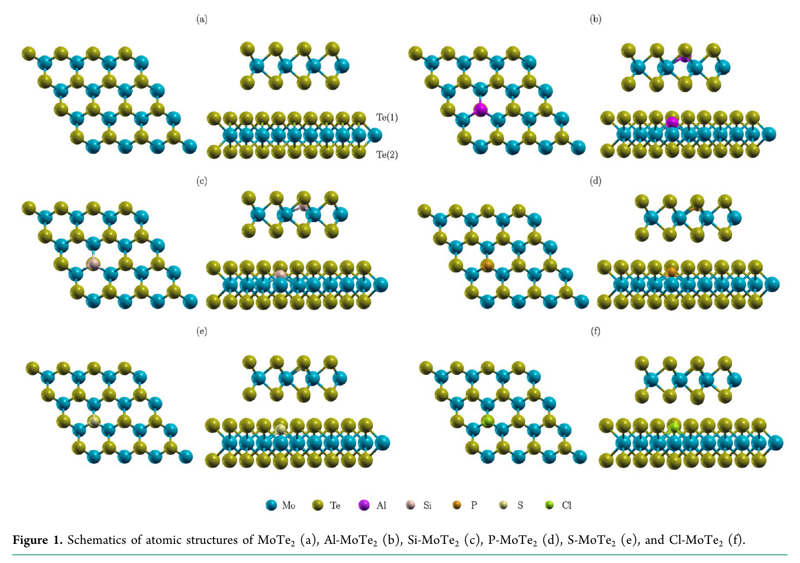
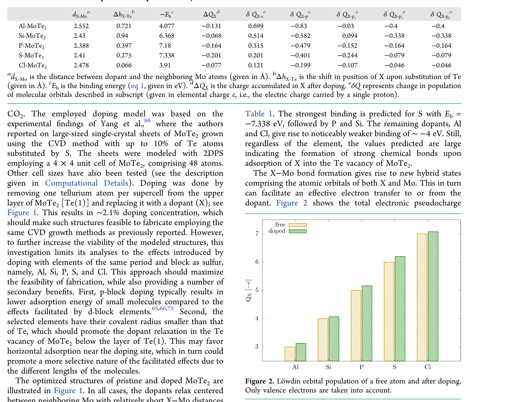
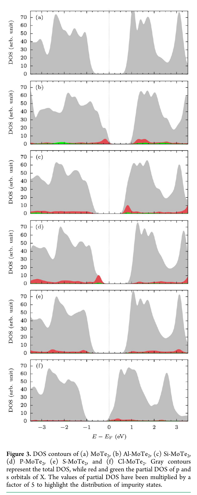
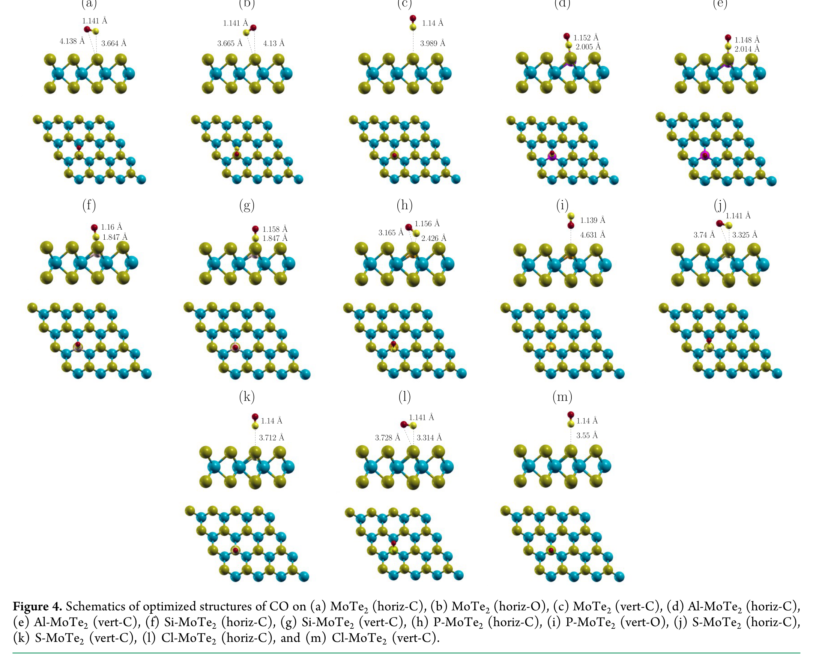
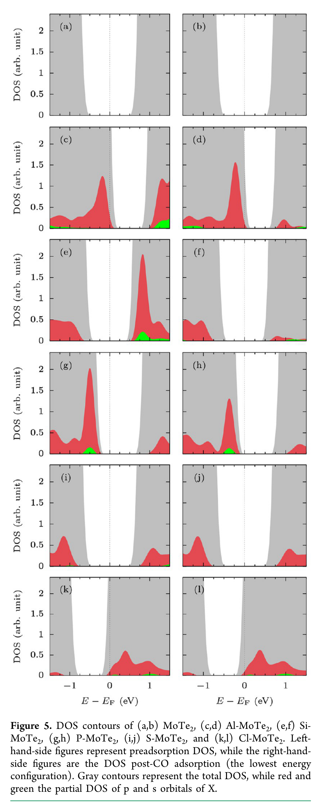
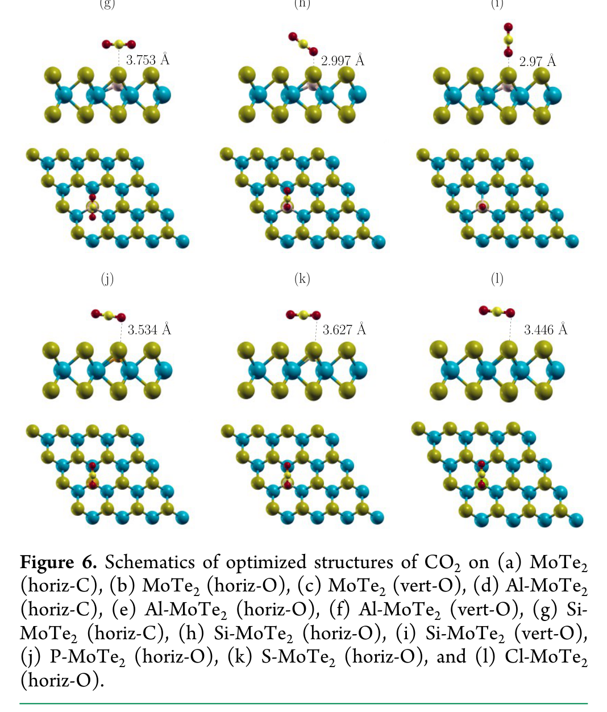
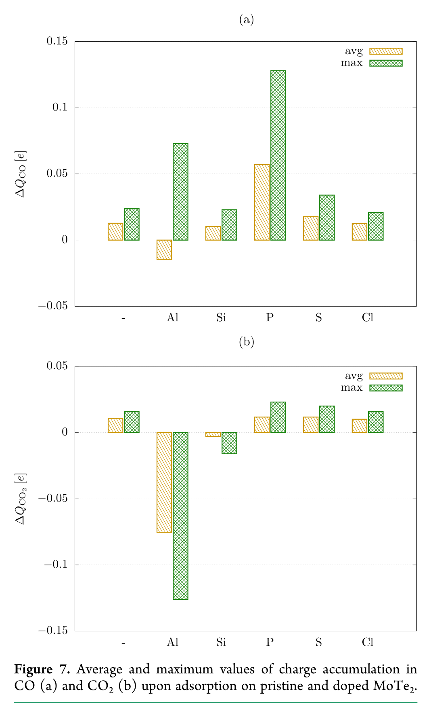
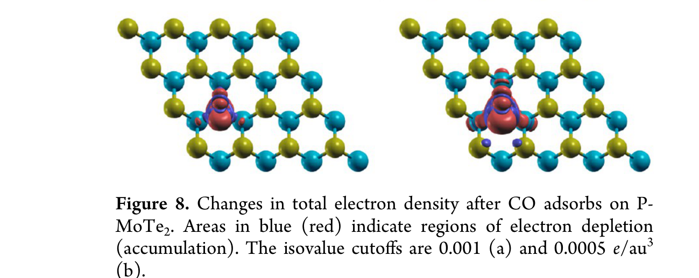
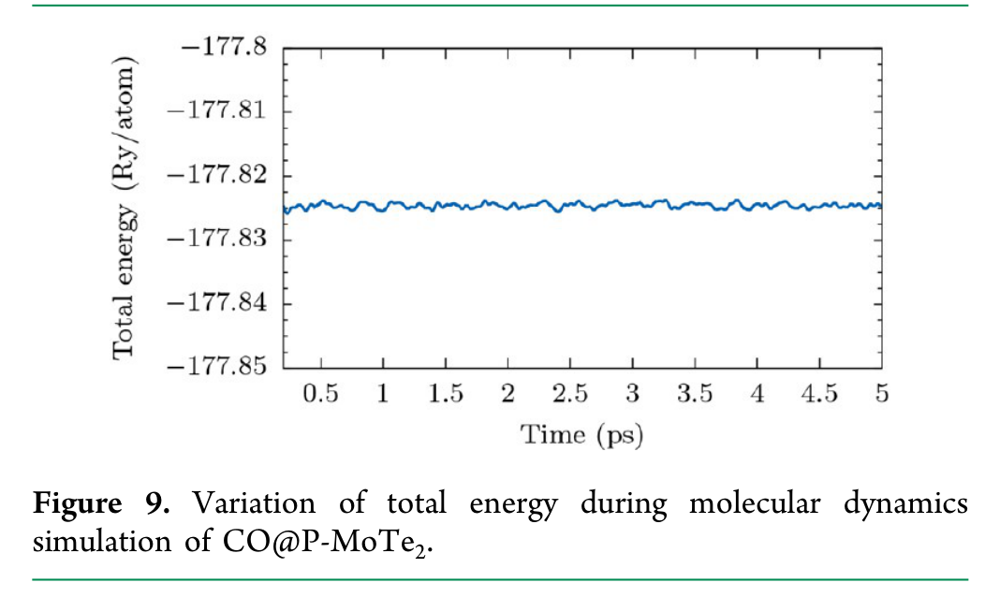

# Figures From paper_002.pdf

## Figure 1 (Page 2)

Figure 1. Schematics of atomic structures of MoTe2 (a), Al-MoTe2 (b), Si-MoTe2 (c), P-MoTe2 (d), S-MoTe2 (e), and Cl-MoTe2 (f).

## Figure 2 (Page 3)

Figure 2. Löwdin orbital population of a free atom and after doping. Only valence electrons are taken into account.

## Figure 3 (Page 4)

Figure 3. DOS contours of (a) MoTe2, (b) Al-MoTe2, (c) Si-MoTe2, (d) P-MoTe2, (e) S-MoTe2, and (f) Cl-MoTe2. Gray contours represent the total DOS, while red and green the partial DOS of p and s orbitals of X. The values of partial DOS have been multiplied by a factor of 5 to highlight the distribution of impurity states.

## Figure 4 (Page 6)

Figure 4. Schematics of optimized structures of CO on (a) MoTe2 (horiz-C), (b) MoTe2 (horiz-O), (c) MoTe2 (vert-C), (d) Al-MoTe2 (horiz-C), (e) Al-MoTe2 (vert-C), (f) Si-MoTe2 (horiz-C), (g) Si-MoTe2 (vert-C), (h) P-MoTe2 (horiz-C), (i) P-MoTe2 (vert-O), (j) S-MoTe2 (horiz-C), (k) S-MoTe2 (vert-C), (l) Cl-MoTe2 (horiz-C), and (m) Cl-MoTe2 (vert-C).

## Figure 5 (Page 7)

Figure 5. DOS contours of (a,b) MoTe2, (c,d) Al-MoTe2, (e,f) Si- MoTe2, (g,h) P-MoTe2, (i,j) S-MoTe2, and (k,l) Cl-MoTe2. Left- hand-side figures represent preadsorption DOS, while the right-hand- side figures are the DOS post-CO adsorption (the lowest energy configuration). Gray contours represent the total DOS, while red and green the partial DOS of p and s orbitals of X.

## Figure 6 (Page 8)

Figure 6. Schematics of optimized structures of CO2 on (a) MoTe2 (horiz-C), (b) MoTe2 (horiz-O), (c) MoTe2 (vert-O), (d) Al-MoTe2 (horiz-C), (e) Al-MoTe2 (horiz-O), (f) Al-MoTe2 (vert-O), (g) Si- MoTe2 (horiz-C), (h) Si-MoTe2 (horiz-O), (i) Si-MoTe2 (vert-O), (j) P-MoTe2 (horiz-O), (k) S-MoTe2 (horiz-O), and (l) Cl-MoTe2 (horiz-O).

## Figure 7 (Page 9)

Figure 7. Average and maximum values of charge accumulation in CO (a) and CO2 (b) upon adsorption on pristine and doped MoTe2.

## Figure 8 (Page 10)

Figure 8. Changes in total electron density after CO adsorbs on P- MoTe2. Areas in blue (red) indicate regions of electron depletion (accumulation). The isovalue cutoffs are 0.001 (a) and 0.0005 e/au3

## Figure 9 (Page 10)

Figure 9. Variation of total energy during molecular dynamics simulation of CO@P-MoTe2.
